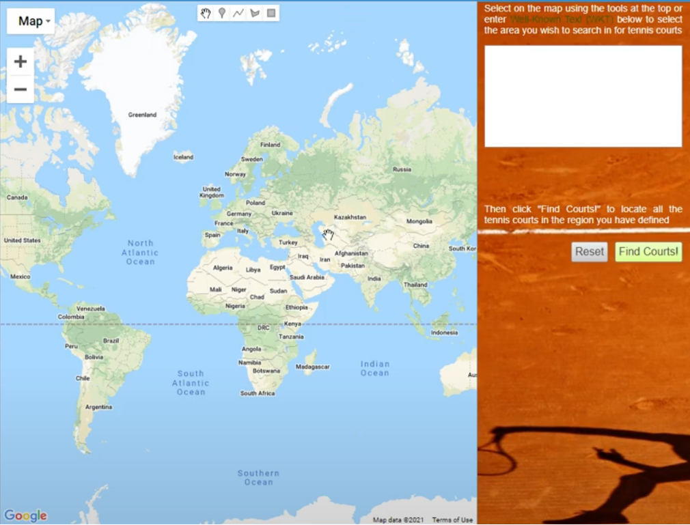
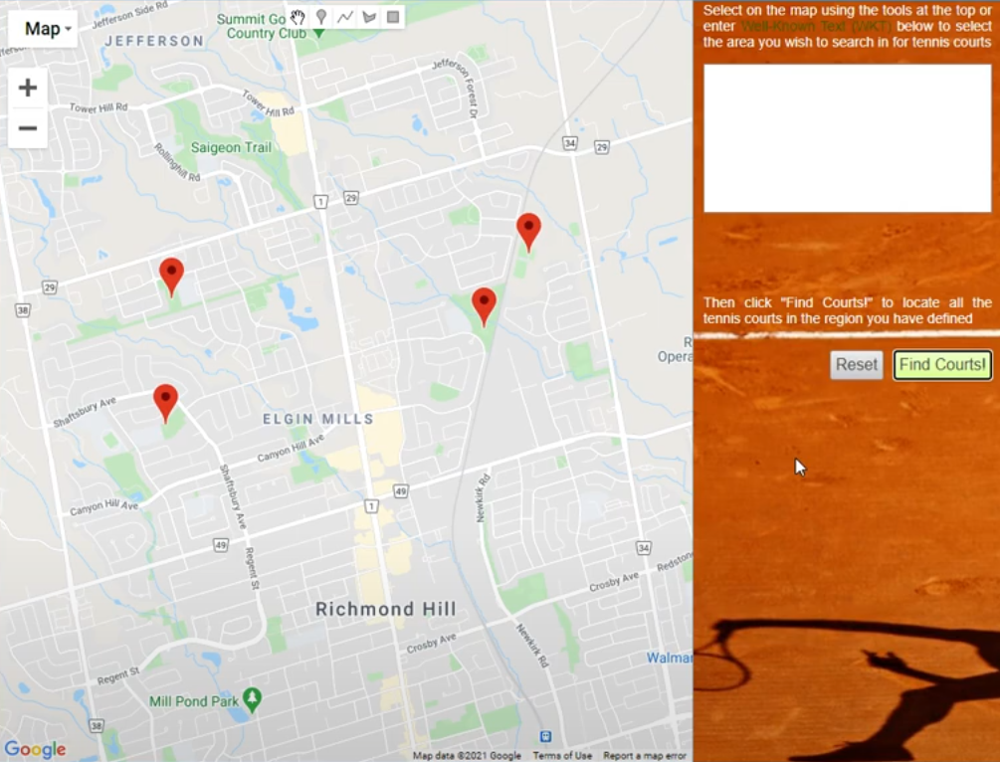

# TennisCourtLocator

## Video Demo

https://www.youtube.com/watch?v=tEGXiUcDwog

## Pictures

## Inspiration
Exercise is important for both physical and mental health, especially during a pandemic. However, it has been rather difficult to find safe ways to exercise with friends given the social distancing measures. Scientific research shows that the safest way to exercise outdoors is through playing tennis.

Unfortunately, Google Maps searching does not work well in finding public tennis courts. Searching for "tennis" on Google Maps only shows expensive tennis clubs, not open park tennis courts for people to walk-in and play. We decided to build a tool to address this problem. This tool can help people find tennis courts to enjoy safe outdoor activities during the Covid-19 pandemic.

## What it does
The user can select an area for court searching on the Google Map API on our website. Then, our backend computer vision model will analyze satellite imagery of the area, identifying and marking all tennis courts on the map.

## How we built it
We used Javascript to build a website frontend. Connected to a Python Flask web server, we used Google Statics Map API for downloading satellite imagery and OpenCV computer vision framework to analyze the image.

## Challenges we ran into
It was very difficult to find the right algorithm for computer vision recognition of tennis courts. We tried homography detection and template matching to unsatisfactory results. We eventually settled with Canny edge detection + Hough line transformation, and used math models to analyze the inferred lines to match the shape of a tennis court.

## Accomplishments that we're proud of
We learned to apply our knowledge in ML/CV in a practical real-life example, especially for a sport that we love.

## What we learned
Testing & fine-tuning different computer vision algorithms. Running website & backend server to host a recognition model.

## What's next for CourtFind!
We might try to extend the algorithm to find other things like outdoor pools, BBQ sites, etc.

## Usage
To use this project yourself, you can clone the repo, create your own google api key with static maps api and maps javascript api, paste your key into the UI/sandbox-gmaps3.html and create a text file in the main directory called apikey.txt that contains only the api key. Then run the server.py python file, and then open sandbox-gmaps3.html with your favorite browsers

## Shoutouts

Special thanks to arthur-e and his [wiket repo](https://github.com/arthur-e/Wicket) that served as a base for our user interface
